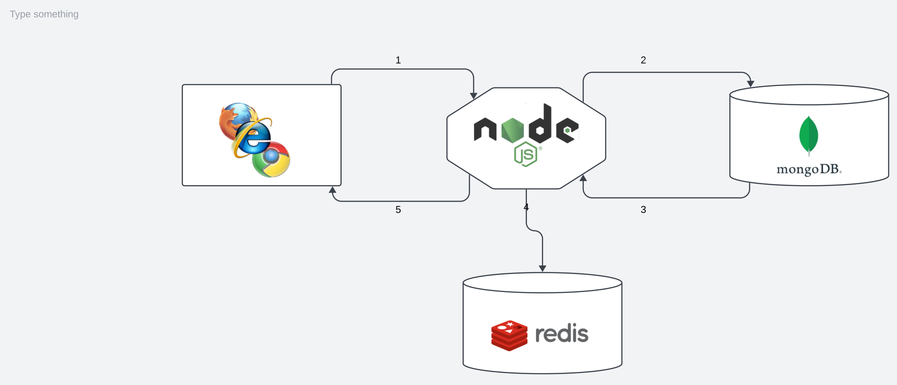

# Learning Express Sessions, Authentication, and Authorization

A repository documenting the learning process of using `express-session` for session management, implementing authentication, authorization, and using MongoDB as well as Redis for storage.

## Table of Contents

- [Introduction](#introduction)
- [Technologies Used](#technologies-used)
- [Getting Started](#getting-started)
- [Sessions with express-session](#sessions-with-express-session)
- [Authentication Strategies](#authentication-strategies)
- [Authorization Middleware](#authorization-middleware)
- [MongoDB for Data Storage](#mongodb-for-data-storage)
- [Redis for Session Storage](#redis-for-session-storage)
- [Usage](#usage)
- [Contributing](#contributing)
- [License](#license)

## Introduction

Provide an overview of the purpose of this repository and what the project aims to achieve. Explain the importance of learning about `express-session`, authentication, authorization, and the use of MongoDB and Redis.

## Technologies Used

List the main technologies, frameworks, and libraries used in this project. Include links to their documentation or relevant resources.

- Node.js
- Express.js
- `express-session`
- MongoDB
- Redis
- Other relevant technologies

## Getting Started

Include instructions on how to set up the project locally. This could involve cloning the repository, installing dependencies, setting up environment variables, etc.

## Sessions with express-session

Explain the concept of sessions and how they are managed using `express-session`. Cover session configuration, middleware setup, and any best practices.

## Authentication Strategies

Discuss various authentication strategies like JWT, Passport.js, OAuth, etc. Explain how these strategies work and their implementation with Express.

## Authorization Middleware

Explain the concept of authorization, role-based access control, and how to create middleware for protecting routes based on user roles or permissions.

## MongoDB for Data Storage

Detail the usage of MongoDB for storing application data. Include information about connecting to MongoDB, CRUD operations, and data modeling.

## Redis for Session Storage

Describe the role of Redis in session storage. Explain how to set up Redis, configure it with `express-session`, and its advantages in session management.

## Usage

Provide examples, code snippets, or instructions on how to use the learned concepts in practical applications. Show how to implement authentication, authorization, and session management in an Express.js application using MongoDB and Redis.

## Contributing

Explain how others can contribute to this repository. Include guidelines for submitting issues, feature requests, or pull requests.

## License

State the license for this project.

