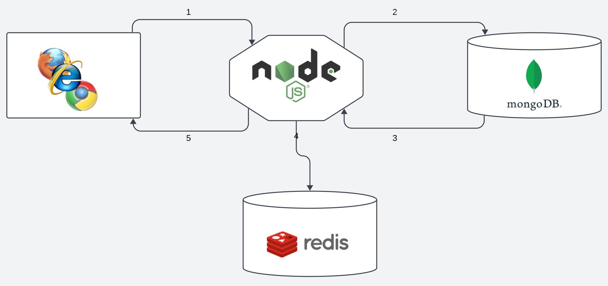

# Learning Express Sessions, Authentication, and Authorization

A repository documenting the learning process of using `express-session` for session management, implementing authentication, authorization, and using MongoDB as well as Redis for storage.

## Table of Contents

- [Introduction](#introduction)
- [Technologies Used](#technologies-used)
- [Getting Started](#getting-started)
- [Sessions with express-session](#sessions-with-express-session)
- [Authentication Strategies](#authentication-strategies)
- [Authorization Middleware](#authorization-middleware)
- [MongoDB for Data Storage](#mongodb-for-data-storage)
- [Redis for Session Storage](#redis-for-session-storage)
- [Usage](#usage)
- [Contributing](#contributing)
- [License](#license)

## Introduction

This resource for individuals seeking to understand and implement key aspects of web application development, specifically focusing on session management, authentication, authorization, and effective data storage mechanisms using express-session, MongoDB, and Redis.


## Technologies Used

List the main technologies, frameworks, and libraries used in this project. Include links to their documentation or relevant resources.

- [Nodejs](#Nodejs)
- [Express.js](#Express.js)
- `express-session`
- [Mongodb](#Mongodb)
- [Redis](#Redis)

## Nodejs
### Node.js Overview:
Node.js is an open-source, server-side JavaScript runtime built on Chrome's V8 JavaScript engine. It allows developers to run JavaScript on the server, enabling asynchronous event-driven programming.

### Use Cases:
- **Web Development:** Create scalable and high-performance web applications.
- **API Development:** Build robust APIs for client-server communication.
- **Real-time Applications:** Develop real-time chat applications, gaming servers, etc.
- **Microservices:** Implement microservices architecture for modular applications.
- **Command Line Tools:** Develop command line interfaces using JavaScript.

### Installation:
To install Node.js, download the installer from the [official Node.js website](https://nodejs.org/), or use package managers like npm or yarn.

### Basic Commands:
- **Check Node.js Version:**
    ```bash
    node --version
    ```

- **Run a JavaScript File:**
    ```bash
    node filename.js
    ```

- **Initialize a Node.js Project:**
    ```bash
    npm init
    ```

- **Install a Package:**
    ```bash
    npm install package-name
    ```
## Express.js
### Express.js Overview:
Express.js is a minimal and flexible Node.js web application framework that provides a robust set of features for web and mobile applications. It's designed for building web APIs and handling HTTP requests.

### Key Features:
- **Routing:** Easily define application routes for handling different HTTP methods.
- **Middleware:** Use middleware functions to modify request and response objects.
- **Templating Engines:** Integrate various templating engines like EJS, Handlebars, etc.
- **HTTP Utility Methods:** Simplify handling HTTP requests and responses.
- **Error Handling:** Efficiently manage errors with middleware.

### Installation:
To use Express.js in a Node.js project, install it via npm:
```bash
npm install express
```

### Basic Usage:
```javascript
const express = require('express');
const app = express();

app.get('/', (req, res) => {
  res.send('Hello, Express!');
});

app.listen(3000, () => {
  console.log('Express server running on port 3000');
});
```

[Express.js](https://expressjs.com/en/5x/api.html) provides a simple and powerful framework for creating web applications, APIs, and handling HTTP requests and responses efficiently.

## Mongodb
### MongoDB Overview:
MongoDB is a popular, open-source NoSQL database that uses a document-oriented data model. It's designed for scalability, high performance, and ease of development.

### Key Features:
- **Document-Oriented:** Stores data in flexible, JSON-like documents.
- **Scalability:** Supports horizontal scaling through sharding.
- **High Performance:** Provides high-speed reads and writes with indexing.
- **Aggregation Framework:** Allows advanced querying and analysis.
- **Flexible Schema:** No rigid schema requirements, enabling easy data manipulation.

### MongoDB Installation:
MongoDB can be installed either locally or accessed through MongoDB Atlas, a cloud-based service.

#### Local Installation:
To install MongoDB locally:

1. **Follow these steps:**
    - Download MongoDB from the [official MongoDB website](https://www.mongodb.com/try/download/community).
    - Choose the appropriate version for your operating system.
    - Install MongoDB according to the provided instructions.

2. **Start MongoDB Service:**
    ```bash
    sudo service mongod start
    ```

3. **Access MongoDB Shell:**
    ```bash
    mongo
    ```

#### MongoDB Atlas:
MongoDB Atlas is a cloud-based service for managing MongoDB databases.

1. **Sign Up for MongoDB Atlas:**
    - Visit the [MongoDB Atlas website](https://www.mongodb.com/cloud/atlas) and sign up for an account.

2. **Create a Cluster:**
    - Follow the steps provided in the Atlas dashboard to create a new cluster.

3. **Connect to Your Cluster:**
    - Obtain the connection string from Atlas and use it in your application to connect to the cluster.

MongoDB Atlas offers a convenient way to deploy, manage, and scale MongoDB databases in the cloud without the hassle of manual setup and maintenance.


## Redis
### Redis Overview:
Redis is an open-source, in-memory data structure store used as a database, cache, and message broker. It's known for its speed and versatility, handling various types of data structures like strings, hashes, lists, sets, and more.

### Use Cases:
- **Caching:** Store frequently accessed data to speed up applications.
- **Session Store:** Store session data for quick retrieval.
- **Message Broker:** Facilitate communication between different parts of an application.
- **Real-time Analytics:** Manage real-time data for analytics purposes.
- **Queues:** Create distributed queues to manage tasks and jobs.

### Installation:
To install Redis on Ubuntu, you can use the apt package manager:

1. **Update Package List:** 
    ```bash
    sudo apt update
    ```

2. **Install Redis Server:**
    ```bash
    sudo apt install redis-server
    ```

### Basic Commands:

1. **Start Redis Server:**
    ```bash
    sudo service redis-server start
    ```

2. **Stop Redis Server:**
    ```bash
    sudo service redis-server stop
    ```

3. **Check Redis Status:**
    ```bash
    sudo service redis-server status
    ```

4. **Access Redis CLI:**
    ```bash
    redis-cli
    ```

5. **Set a Key-Value Pair:**
    ```bash
    SET key value
    ```

6. **Get Value by Key:**
    ```bash
    GET key
    ```

7. **Add Element to a List:**
    ```bash
    LPUSH list_name value
    ```

8. **Retrieve Elements from a List:**
    ```bash
    LRANGE list_name start stop
    ```

[Redis ](https://redis.io/docs/connect/cli/) offers numerous commands and configurations for different data needs and structures. 


## Getting Started

Include instructions on how to set up the project locally. This could involve cloning the repository, installing dependencies, setting up environment variables, etc.

## Sessions with express-session

Explain the concept of sessions and how they are managed using `express-session`. Cover session configuration, middleware setup, and any best practices.

## Authentication Strategies

Discuss various authentication strategies like JWT, Passport.js, OAuth, etc. Explain how these strategies work and their implementation with Express.

## Authorization Middleware

Explain the concept of authorization, role-based access control, and how to create middleware for protecting routes based on user roles or permissions.

## MongoDB for Data Storage

Detail the usage of MongoDB for storing application data. Include information about connecting to MongoDB, CRUD operations, and data modeling.

## Redis for Session Storage

Describe the role of Redis in session storage. Explain how to set up Redis, configure it with `express-session`, and its advantages in session management.

## Usage

Provide examples, code snippets, or instructions on how to use the learned concepts in practical applications. Show how to implement authentication, authorization, and session management in an Express.js application using MongoDB and Redis.

## Contributing

Explain how others can contribute to this repository. Include guidelines for submitting issues, feature requests, or pull requests.

## License

State the license for this project.


